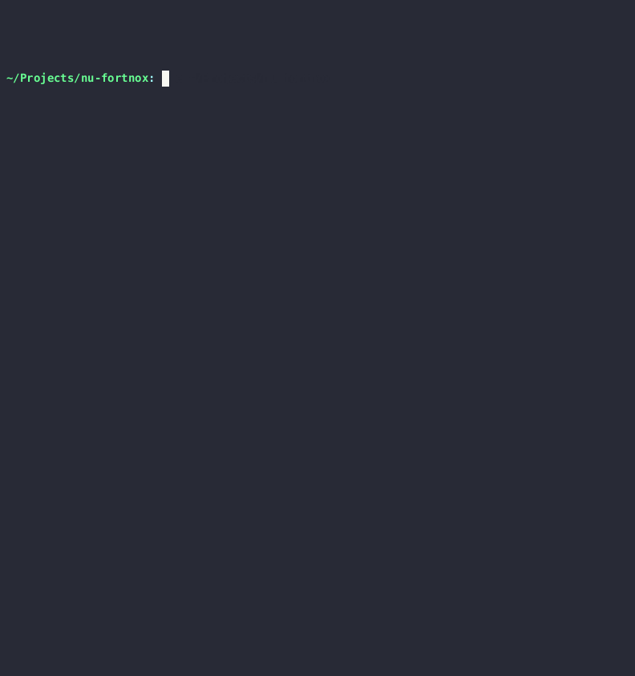

# nu-fortnox

WIP, currently primarily focused on supporting Fortnox API for resource: 'invoices'




```nushell
fortnox invoices --for-quarter 1 --for-year 2024 --page 1..
    | to csv
    | save Invoices_2024-Q1.csv
```


Or fetch a list of invoices by length 1 ( where '--limit' is equivalent to 'per page' ):

```nushell
fortnox invoices -l 1
```

## Installation

```nushell
use nupm
nump install --force --path .
```

## Usage

As module:
```nushell
use nu-fortnox
overlay use nu-fortnox
fortnox invoices -h # To show all available flags
```
or
```nushell
use ./nu-fortnox *
fortnox invoices -h # To show all available flags
```


### Configuration

nu-fortnox expects mongodb database to contain a collection 'credentials' with the following pre-existing document for OAuth tokens from Fortnox:

```typescript
type {
    expiresAt?: ISODate(),
    accessToken?: string,

    provider: "fortnox", // Can be changed with $env._FORTNOX_DB_CREDENTIALS_QUERY
    clientIdentity: string,
    clientSecret: string,
    refreshToken: string,
}
```

It will try to create/update fields for 'expiresAt', 'accessToken' and 'refreshToken' after using refresh token with Fortnox API.

### Create .env.nu

```nushell
export-env {
    $env.DB_CONNECTION_STRING = "mongodb://<login>:<password>@localhost:27017/my-database"
    $env._FORTNOX_USE_CACHE = true
    $env._FORTNOX_DB_CREDENTIALS_QUERY = '{"provider": "fortnox"}'
}
```

### Flags
```md
Returns an empty list if no resources was found

Usage:
  > main {flags} (method)

Flags:
  --action <CompleterWrapper(String, 617)> -  (default: '')
  -i, --invoice-number <CompleterWrapper(Int, 614)> - Get a known invoice by its invoice number
  --filter <CompleterWrapper(String, 616)> - Filters for invoices:  'unbooked', 'cancelled', 'fullypaid', 'unpaid', 'unpaidoverdue'
  -l, --limit <Int> - Limit how many resources to fetch, expects integer [1-100] (default: 100)
  -p, --page <Range> - If range is higher than 1..1, limit must be set to 100 (default: 1..1)
  -s, --sort-by <CompleterWrapper(String, 618)> - Set 'sortby' param for Fortnox request (default: 'documentnumber')
  -s, --sort-order <CompleterWrapper(String, 619)> - Set 'sortorder' param for Fortnox Request, expects 'ascending' or 'descending' (default: 'descending')
  --body <Any> - Request body to POST or PUT to Fortnox API for actions: 'create' or 'update'
  -f, --your-order-number <String> - Returns list of Invoice(s) filtered by YourOrderNumber
  -c, --customer-name <String> - Returns list of Invoice(s) filtered by CustomerName
  -m, --last-modified <Any> - Returns list of Invoice(s) filtered by last modified date
  -s, --from-date <String> - Fortnox 'fromdate' param, expects 'YYYY-M-D'
  -e, --to-date <String> - Fortnox 'todate' param, expects 'YYYY-M-D, cannot not be used without 'from-date', 'from', 'date' or 'for-[year quarter month day]
  -d, --date <String> - Sets both 'fromdate' and 'todate' to this value, useful if you want a single day. Expects: 'YYYY-M-D'
  --from <CompleterWrapper(String, 620)> - Fortnox 'fromdate' in a readable datetime string, see 'into datetime --list-human'
  --from-final-pay-date <String> -
  --to-final-pay-date <String> -
  -Y, --for-year <Int> - Specify from/to date range by year, expects integer above 1970
  -Q, --for-quarter <Int> - Specify from/to date range by quarter, expects integer [1-4]
  -M, --for-month <Int> - Specify from/to date range by month, expects integer [1-12]
  -D, --for-day <Int> - Specify from/to date range by day, expects integer [1-32]
  --no-cache - Don't use cached result.
  --dry-run - Dry run, log the Fortnox API url, returns 'nothing'
  -b, --brief - Filter out empty values from result
  -O, --obfuscate - Filter out Confidential information. Does not remove not Country ISO codes
  -P, --with-pagination - Return result includes Fortnox 'MetaInformation' for pagination: @TotalResource, @TotalPages, @CurrentPage
  --raw - Returns least modified Fortnox response, --raw is mutually exclusive with --brief, --obfuscate and --with-pagination
  -h, --help - Display the help message for this command

Parameters:
  method <string>: Perform PUT, POST or GET action for invoice at Fortnox API (optional, default: 'get')

Input/output types:
  ╭───┬───────┬────────╮
  │ # │ input │ output │
  ├───┼───────┼────────┤
  │ 0 │ any   │ any    │
  ╰───┴───────┴────────╯
```

